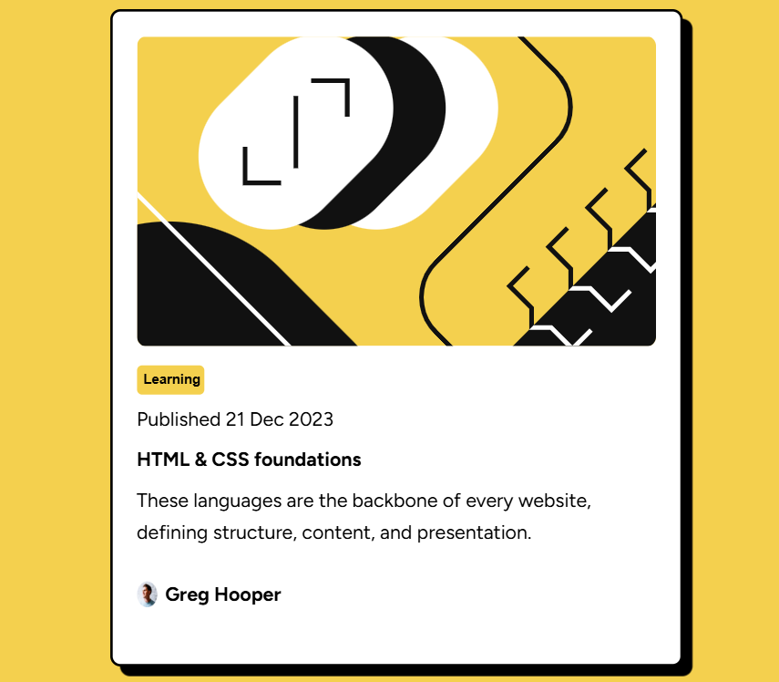

# Frontend Mentor - Blog preview card solution

This is a solution to the [Blog preview card challenge on Frontend Mentor](https://www.frontendmentor.io/challenges/blog-preview-card-ckPaj01IcS). Frontend Mentor challenges help you improve your coding skills by building realistic projects. 

## Table of contents

- [Overview](#overview)
  - [The challenge](#the-challenge)
  - [Screenshot](#screenshot)
  - [Links](#links)
- [My process](#my-process)
  - [Built with](#built-with)
  - [What I learned](#what-i-learned)
  - [Continued development](#continued-development)
  - [Useful resources](#useful-resources)
- [Author](#author)


**Note: Delete this note and update the table of contents based on what sections you keep.**

## Overview

### The challenge

Users should be able to:

- See hover and focus states for all interactive elements on the page

### Screenshot




### Links

- Solution URL: [Github](https://github.com/Prince-AA-4)
- Live Site URL: [Netlify](https://princeblogpostdesign.netlify.app/)

## My process

### Built with

- Semantic HTML5 markup
- CSS custom properties
- Flexbox


### What I learned

I learnt how to use the filter property and how relative units affect conatiners

To see how you can add code snippets, see below:


```css
.proud-of-this-css {
  filter: drop-shadow(10px 10px black);
}
```

### Continued development

Transitions
Achieving responsiveness with relative units

### Useful resources

- [W3schools](https://www.w3schools.com) - This helped me to differentiate between relative units and the advantages of using them. I really liked this pattern and will use it going forward.
- [GeeksforGeeks](https://www.geekforgeeks.com) - This is an amazing article which also helped me understand the units used in css. I'd recommend it to anyone still learning this concept.

## Author

- Website - [Prince Asare Agyekum](https://www.your-site.com)
- Frontend Mentor - [@Prince-AA-4](https://www.frontendmentor.io/profile/yourusername)


